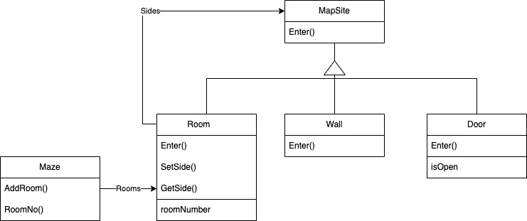

# Maze

## Room
- Each room has four sides: north, south, east, west
- concrete subclass of MapSite that defines the key relationships between components in a maze.
- maintains references to other MapSite objects and stores a room number
- the number will identify rooms in the maze

## Mapsite
- common abstract class for all components of a maze
- Enter - its meaning depends on what you're opening.
- if you enter a room, then your location changes.
- if you try to enter a door, then one of two things happen:
    1. you go into the next room
    2. or you hit a wall
